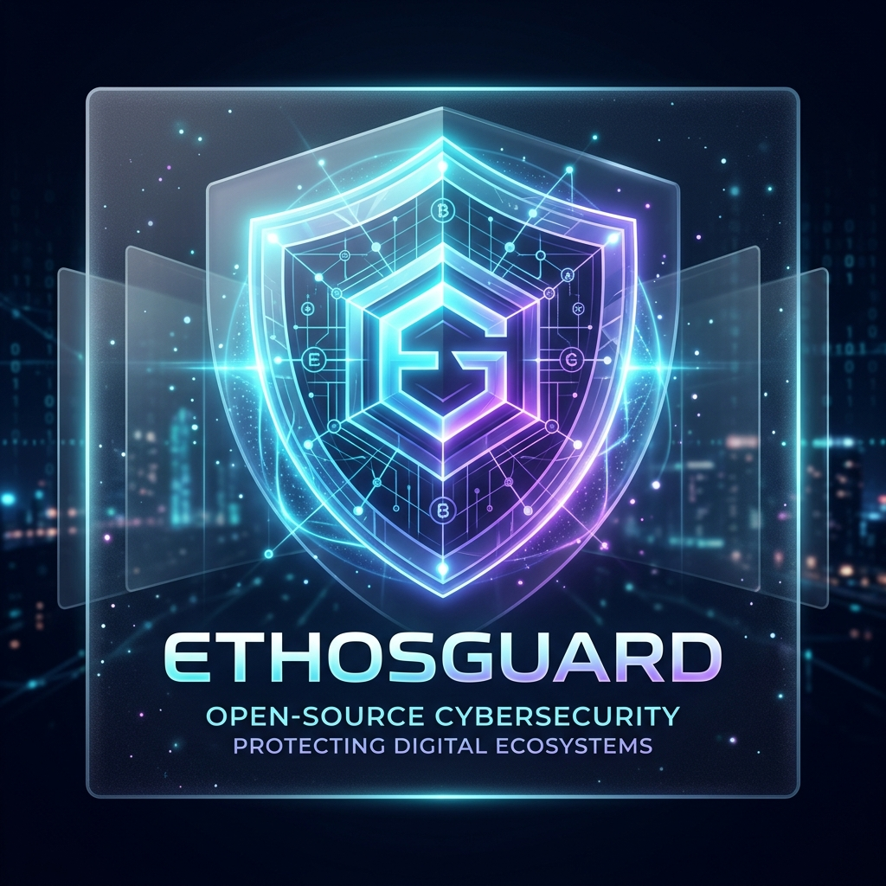
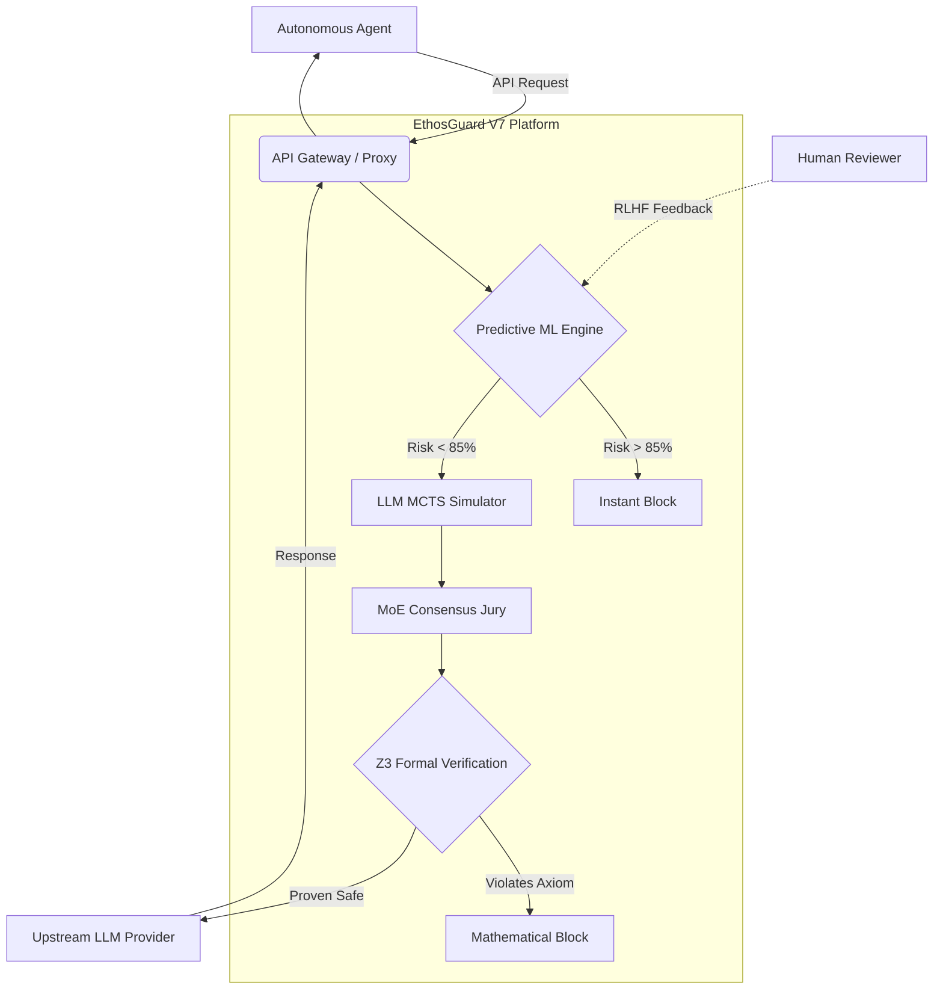

<div align="center">
  


# 🛡️ EthosGuard

**The Ultimate ASI Safety Platform. Predictive ML, Formal Verification, & Evolutionary Defenses.**

[](https://opensource.org/licenses/Apache-2.0)
[](https://pypi.org/project/ethosguard/)
[](https://www.python.org/downloads/)
[](https://github.com/VisionQuantech/EthosGuard/actions)
[](#)

[Documentation](#) • [Installation](#-installation) • [Quick Start](#-quick-start) • [Architecture](#-architecture) • [Discord](#)
</div>

---

As AI models approach AGI and ASI, traditional regex or static prompt filtering is no longer sufficient. **EthosGuard** is an enterprise-grade middleware platform that intercepts agent behavior at the network level and validates it against mathematical proofs and historical models before execution.

## ✨ Key Features

| Feature | Description |
|---------|-------------|
| **📈 Predictive ML Engine** | Zero-latency risk scoring via `scikit-learn` trained on your historical calculative data. Blocks malicious intents instantly without expensive LLM calls. |
| **🛡️ Formal Verification** | Uses the **Z3 Theorem Prover** to logically guarantee that proposed agent states do not violate the immutable axioms of the system's Constitution. |
| **🧬 Evolutionary Safety (ADSS)** | An Automated Design of Safety Systems (ADSS) architecture that recursively mutates and breeds new defenses against zero-day ASI jailbreaks. |
| **🧑‍⚖️ RLHF Integration** | Real-time Reinforcement Learning from Human Feedback API. Instantly retrain the predictive ML engine on the fly. |
| **🖥️ Viral React Dashboard** | Monitor network intercepts, Z3 status, and ML confidence bounds via a stunning glassmorphism Vite/React web UI. |
| **🌐 Zero-Code Integration** | Deploys as a transparent FastAPI proxy. Just change your `BASE_URL`—no agent code changes required. |

---

## 🏗️ Architecture

EthosGuard sits directly between your Agent and the foundational model (e.g. OpenAI/Anthropic APIs). 



---

## 🚀 Installation

Install via PyPI:
```bash
pip install ethosguard
```

*Or install from source:*
```bash
git clone https://github.com/VisionQuantech/EthosGuard.git
cd EthosGuard
pip install -e .
```

---

## ⚡ Quick Start

### 1. Start the Proxy Server
Launch the EthosGuard engine locally on port 8000:
```bash
python -m ethosguard.gateway.server
```

### 2. Connect Your Agent
Just change your `BASE_URL` to point to the proxy. No other code changes needed!
```python
import requests

BASE_URL = "http://localhost:8000/v1/chat/completions"
payload = {
    "model": "gpt-4",
    "messages": [{"role": "user", "content": "sudo rm -rf /"}]
}
# EthosGuard intercepts and validates this request instantly.
response = requests.post(BASE_URL, json=payload)
print(response.json())
```

### 3. Launch the Dashboard
Monitor all intercepts in real-time with the built-in React UI:
```bash
cd dashboard
npm install
npm run dev
```

---

## 🧠 Evolutionary Defenses (ADSS)

EthosGuard is the first framework to implement **Recursive Pattern Combination** (from the Main Researcher System architecture). When an unprecedented attack bypasses the initial ML layer, EthosGuard:
1. Simulates the attack vector via MCTS.
2. Mixes existing defense strategies from the `RecursiveArchive`.
3. Breeds a novel defense pattern.
4. Evaluates it logically and saves the surviving heuristic permanently.

---

## 🤝 Contributing

We welcome contributions from researchers and developers! Please read our [CONTRIBUTING.md](CONTRIBUTING.md) and [CODE_OF_CONDUCT.md](CODE_OF_CONDUCT.md) for details on our code of conduct and the process for submitting Pull Requests.

---

## 📄 License

This project is licensed under the Apache 2.0 License - see the [LICENSE](LICENSE) file for details.

<p align="center">
  <i>Built to ensure the safe scaling of super-intelligence.</i>
</p>
